## Central Limit Theorem

[Dataset](https://github.com/DiAg-2025/Python--Central-Limit-Theorem/blob/main/weight-height.csv)

[Analysis](https://github.com/DiAg-2025/Python--Central-Limit-Theorem/blob/main/JupyterAnalysis.ipynb)

# 📊 Extra Activity 5 – Central Limit Theorem Simulation

This project presents a simulation study to illustrate the **Central Limit Theorem (CLT)** using height data from the [Weight-Height.csv dataset](https://www.kaggle.com/datasets/mustafaali96/weight-height).

---

## 📚 What is the Central Limit Theorem?

> For a population with any distribution having finite mean (μ) and finite standard deviation (σ), the distribution of sample means (or standardized sums) will **approximately be normal** as the sample size increases.

Mathematically:

Let \( X_1, X_2, ..., X_n \) ~ i.i.d. \( X \) with \( E(X) = \mu \) and \( Var(X) = \sigma^2 \):

- **Case I:**  
  \[
  \frac{\bar{X} - \mu}{\sigma / \sqrt{n}} \to N(0, 1) \quad \text{as} \quad n \to \infty
  \]

- **Case II:** If \( Y = \sum_{i=1}^n X_i \), then:  
  \[
  \frac{Y - n\mu}{\sigma \sqrt{n}} \to N(0, 1) \quad \text{as} \quad n \to \infty
  \]

---

## 📊 Population Statistics

- **Population Mean:** 66.367  
- **Population Std Dev:** 3.847  

**Population Histogram**  

  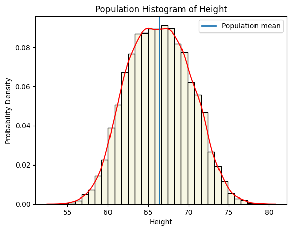

---

## 🔍 Case I – CLT for Sample Means

| N   | Mean of Sample Means | SD of Sample Means | Theoretical SD (σ / √n) | CLT Observation |
|-----|----------------------|--------------------|-------------------------|-----------------|
| 5   | 66.175               | 1.731              | 1.720                   | Poor alignment; irregular distribution |
| 10  | 66.236               | 1.391              | 1.217                   | Slightly improved; variability high |
| 30  | 66.328               | 0.632              | 0.702                   | Near normal; CLT emerging |
| 50  | 66.336               | 0.543              | 0.544                   | Strong CLT evidence; symmetric |
| 100 | 66.394               | 0.363              | 0.385                   | CLT fully realized; mean ≈ true mean |

**Histograms**  

  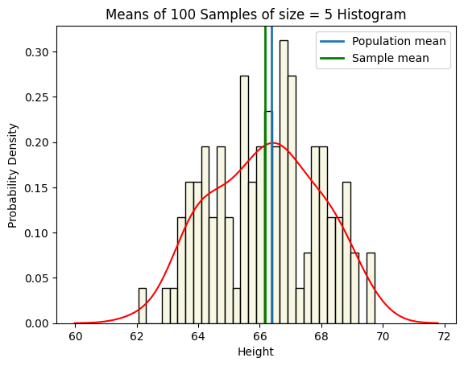
  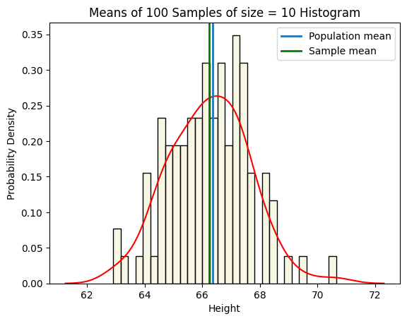
  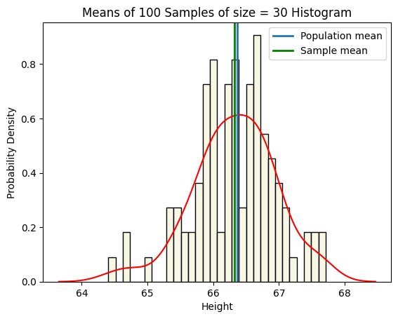

  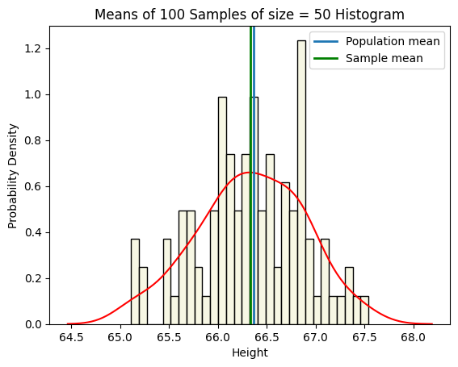
  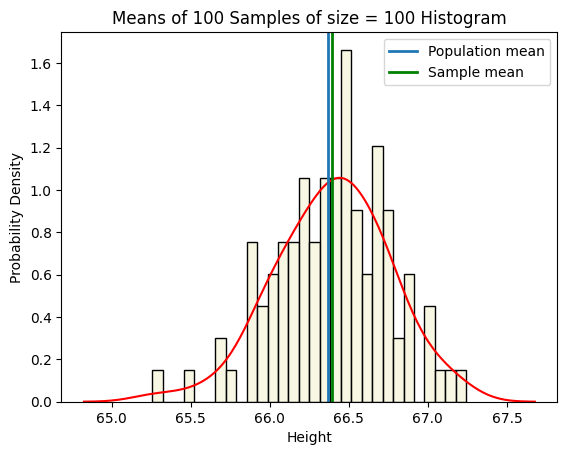

---

## 🔍 Case II – CLT for Sum of Sample Values

| N   | SD of Sample Sums | Theoretical SD (σ × √n) | CLT Observation |
|-----|-------------------|-------------------------|-----------------|
| 5   | 8.276             | 8.602                   | Irregular distribution |
| 10  | 12.777            | 12.165                  | Slightly better, still irregular |
| 30  | 20.457            | 21.071                  | Near normal |
| 50  | 23.250            | 27.202                  | Symmetric, nearly normal |
| 100 | 35.830            | 38.470                  | Close to normal |

**Histograms**  

  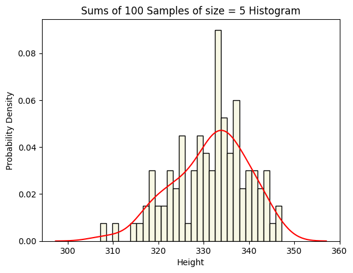
  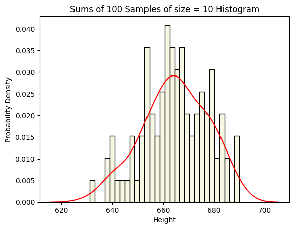
  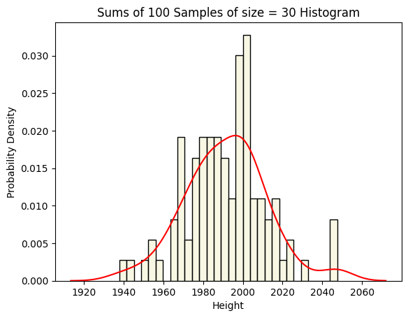

  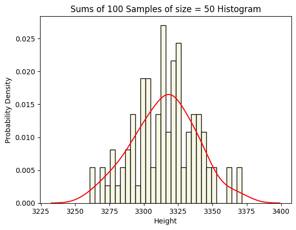
  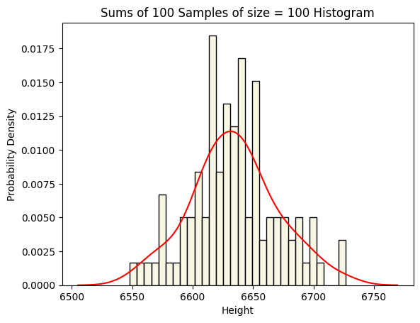

---

## 📌 Final Conclusions

### Case I – Sample Means
- **N = 5:** Poor alignment; irregular shape  
- **N = 10:** Slight improvement; still irregular  
- **N = 30:** Clearly approaching normal distribution  
- **N = 50:** Strong CLT evidence; symmetric  
- **N = 100:** CLT fully realized; minimal variability  

### Case II – Sample Sums
- **N = 5:** Irregular distribution  
- **N = 10:** Slight improvement  
- **N = 30:** Near normal  
- **N = 50:** Symmetric, nearly normal  
- **N = 100:** Close to normal  

---

## 📈 Key Takeaways
- Larger sample sizes → sampling distributions closer to normal.
- **Sample means:** Standard deviation decreases with larger N (**Weak Law of Large Numbers**).
- **Sample sums:** Standard deviation increases with N, but distribution shape normalizes.

---

> **Note:** Store all plot images in an `images/` folder at the root of your repo so they display correctly on GitHub.
